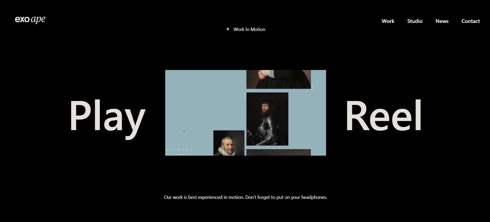
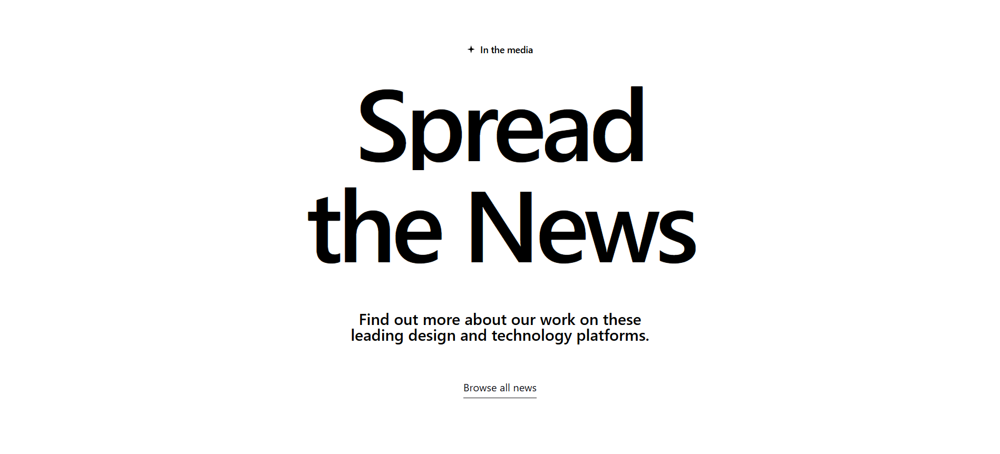
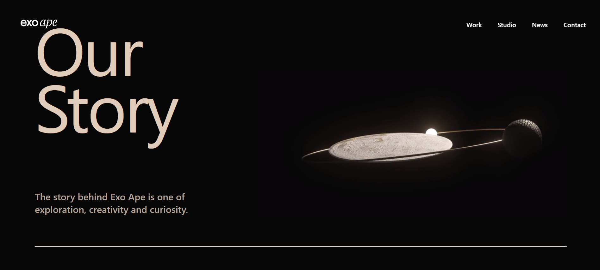

# Studio D | Motion-Driven Agency Platform 🚀

[](#)
[](#)
[](#)

A high-performance, motion-driven frontend web application inspired by award-winning creative agency designs. This project focuses on delivering an immersive, fluid user experience through complex scroll animations and modern UI architecture.

<p align="center">
  
  
</p>
<p align="center">
  
  
</p>
<p align="center">
  
</p>

>

## ✨ Key Features

- **Custom Smooth Scrolling:** Overrides native browser scrolling with Locomotive Scroll for a buttery-smooth 60fps experience.
- **Scroll-Triggered Animations:** Utilizes GSAP (ScrollTrigger) for complex, timeline-based parallax and reveal effects as the user navigates the page.
- **Component-Level Motion:** Integrates Framer Motion for elegant, staggered typography reveals and seamless UI element transitions.
- **Modern Architecture:** Built with React 19 and Vite for blazing-fast HMR and optimized production builds.
- **Responsive Design:** Fully styled with Tailwind CSS, ensuring the complex grid layouts and video assets adapt flawlessly across all devices.

## 🛠️ Tech Stack

- **Framework:** React.js (v19)
- **Build Tool:** Vite
- **Styling:** Tailwind CSS (v4)
- **Animation & Motion:** \* GSAP (GreenSock Animation Platform) + ScrollTrigger
  - Framer Motion
  - Locomotive Scroll
- **Icons:** React Icons

## 🚀 Getting Started

To get a local copy up and running, follow these simple steps.

### Prerequisites

- Node.js (v18 or higher recommended)
- npm or yarn

### Installation

1. Clone the repo:
   ```bash
   git clone https://github.com/techDhiraj053/studio-d.git
   ```
